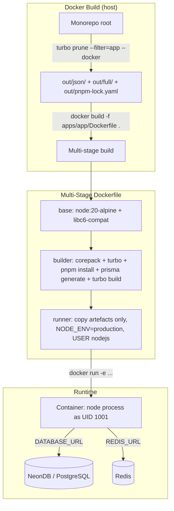

# Design Document — docker-containerization

## Overview

This design covers production-grade Docker containerization for the `betterstack1` Turborepo + pnpm monorepo. Four applications are containerized independently: `web` (Next.js 16), `backend` (Express 5), `worker` (Redis Streams consumer), and `pusher` (Redis Streams producer/scheduler). Each image is built from the monorepo root using `turbo prune --docker` to isolate dependencies, multi-stage Dockerfiles to exclude build tooling from the final image, and Node 20 Alpine as the base to keep image sizes small.

External services — Redis (separate Docker container) and PostgreSQL (NeonDB, serverless) — are not containerized here. No `docker-compose` file is produced. The images are designed for Kubernetes deployment: all configuration is injected via environment variables, processes run as a non-root user (UID 1001), and exit codes propagate unmodified so Kubernetes liveness probes work correctly.

### Key Design Decisions

- **`turbo prune --docker` as the first build step**: Runs on the host (outside Docker) to produce a minimal workspace subset before the Docker build context is sent to the daemon. This keeps the context small and makes the install layer deterministic.
- **`out/json/` → install → `out/full/` → build**: The two-phase copy pattern from `turbo prune --docker` is the primary cache optimisation. Package manifests change rarely; source changes constantly. Separating them into distinct layers means a source-only change never re-runs `pnpm install`.
- **`--shamefully-hoist` is not used**: pnpm's default virtual store (`node_modules/.pnpm`) works correctly inside Docker because the entire pruned workspace is copied into the image. Hoisting is unnecessary and would break workspace symlink resolution.
- **`node:20-alpine` in both builder and runner stages**: Prisma generates a native query engine binary (`.so.node`) linked against the musl libc and OpenSSL version of the builder image. Using the same base in the runner ensures binary compatibility without cross-compilation.
- **`@repo/ui` source-only**: The `@repo/ui` package has no build step — it exports `.tsx` files directly. Next.js handles compilation via `transpilePackages`. The pruned workspace includes `packages/ui/src/` and Next.js bundles it during `next build`.
- **Exec-form `CMD`**: All `CMD` instructions use JSON array form (`["node", "dist/index.js"]`) so the Node process is PID 1 and receives signals directly. Shell-form `CMD` would wrap the process in `/bin/sh -c`, masking exit codes.
- **`next.config.js` `output: 'standalone'`**: Required for the web image. Next.js emits a self-contained server bundle under `.next/standalone` that includes a minimal `node_modules` tree, eliminating the need to copy the full workspace `node_modules` into the runner stage.

---

## Architecture



### Build Flow per Application

```
1. turbo prune --filter=<app> --docker
   └── out/
       ├── json/          ← pruned package.json tree (no source)
       ├── full/          ← full source of pruned workspace
       └── pnpm-lock.yaml ← pruned lock file

2. docker build -f apps/<app>/Dockerfile .
   ├── FROM node:20-alpine AS base
   │   └── apk add libc6-compat
   ├── FROM base AS builder
   │   ├── corepack enable && corepack prepare pnpm@9.0.0 --activate
   │   ├── pnpm add -g turbo@2.9.6
   │   ├── COPY out/json/ .          ← cache layer: manifests only
   │   ├── pnpm install --frozen-lockfile
   │   ├── COPY out/full/ .          ← cache layer: source
   │   ├── [prisma generate]         ← backend/worker/pusher only
   │   └── turbo run build --filter=<app>
   └── FROM base AS runner
       ├── addgroup/adduser nodejs (UID/GID 1001)
       ├── ENV NODE_ENV=production
       ├── COPY --chown=nodejs:nodejs <artefacts> from builder
       ├── USER nodejs
       └── CMD ["node", "dist/index.js"]  (or server.js for web)
```

---

## Components and Interfaces

### .dockerignore (monorepo root)

Prevents large or sensitive directories from entering the build context. The build context is sent from the host to the Docker daemon before any `COPY` instruction executes; excluding unnecessary files reduces transfer time and prevents accidental secret leakage.

Excluded patterns:
```
node_modules
.git
.turbo
dist
.next
*.log
.env*
*.pid
.codex-runtime
```

### turbo prune

`turbo prune --filter=<app-name> --docker` is run on the host before `docker build`. It produces:

- `out/json/` — a skeleton of the workspace with only `package.json` files (no source). Used for the dependency installation layer.
- `out/full/` — the complete source of all packages in the dependency graph. Used for the compilation layer.
- `out/pnpm-lock.yaml` — a pruned lock file containing only entries for the pruned graph.

The `--docker` flag is what produces the `out/json/` + `out/full/` split. Without it, `turbo prune` produces a single `out/` directory that cannot be used for the two-phase cache pattern.

### Shared Packages in the Pruned Workspace

| Package | Type | Included in prune for |
|---|---|---|
| `@repo/store` | Compiled (tsc → `dist/`) + Prisma generated client | `backend`, `worker`, `pusher` |
| `@repo/redisstream` | Compiled (tsc → `dist/`) | `worker`, `pusher` |
| `@repo/ui` | Source-only (`.tsx` exports) | `web` |
| `@repo/typescript-config` | Config-only (no build) | all |
| `@repo/eslint-config` | Config-only (no build) | `web` |

### Prisma Client Generation

`@repo/store` uses Prisma with a custom output path:

```prisma
generator client {
  provider = "prisma-client-js"
  output   = "../generated/prisma"
}
```

The generated client lives at `packages/store/generated/prisma/`. The native query engine binary (e.g., `libquery_engine-linux-musl-openssl-3.0.x.so.node`) is platform-specific. Because both builder and runner use `node:20-alpine` (musl libc), the binary generated in the builder stage is compatible with the runner stage.

`prisma generate` must run after `pnpm install` (the `@prisma/client` package must be present) and before `turbo run build` (the application TypeScript imports from the generated client). This ordering is enforced in the Dockerfile and in `turbo.json` via a `db:generate` task.

### next.config.js Changes (web)

Two additions are required:

```js
const nextConfig = {
  output: 'standalone',
  transpilePackages: ['@repo/ui'],
};
```

- `output: 'standalone'` — emits `.next/standalone/` with a self-contained server and a minimal `node_modules` tree. The runner stage copies this directory instead of the full workspace `node_modules`.
- `transpilePackages: ['@repo/ui']` — instructs Next.js to compile `@repo/ui`'s `.tsx` source files during `next build`. Without this, Next.js would attempt to import pre-compiled JS from `@repo/ui`, which does not exist (the package has no build step).

### turbo.json Changes

The current `turbo.json` only declares `.next/**` as build outputs. Three per-package overrides are needed for the TypeScript apps:

```json
{
  "tasks": {
    "build": {
      "dependsOn": ["^build"],
      "outputs": [".next/**", "!.next/cache/**"]
    },
    "db:generate": {
      "cache": false
    },
    "backend#build": {
      "dependsOn": ["^build", "db:generate"],
      "outputs": ["dist/**"]
    },
    "worker#build": {
      "dependsOn": ["^build", "db:generate"],
      "outputs": ["dist/**"]
    },
    "pusher#build": {
      "dependsOn": ["^build", "db:generate"],
      "outputs": ["dist/**"]
    }
  }
}
```

The `db:generate` task is defined in `packages/store/package.json` as `prisma generate`. The `cache: false` on `db:generate` ensures Prisma always regenerates the client (the generated binary is platform-specific and should not be cached across environments).

---

## Data Models

### Environment Variables per Application

#### web

| Variable | Required | Default | Description |
|---|---|---|---|
| `BACKEND_URL` | Optional | `""` | Base URL of the backend API, used by Next.js API routes |
| `PORT` | Optional | `3000` | Port the standalone server listens on |

#### backend

| Variable | Required | Default | Description |
|---|---|---|---|
| `DATABASE_URL` | **Required** | — | NeonDB PostgreSQL connection string |
| `JWT_SECRET` | **Required** | — | Secret key for JWT signing and verification |
| `PORT` | Optional | `3001` | Port the Express server listens on |

#### worker

| Variable | Required | Default | Description |
|---|---|---|---|
| `DATABASE_URL` | **Required** | — | NeonDB PostgreSQL connection string |
| `REDIS_URL` | **Required** | — | Redis connection URL (e.g., `redis://redis:6379`) |
| `REGION_ID` | **Required** | — | Redis Stream consumer group name; identifies the geographic region |
| `WORKER_ID` | **Required** | — | Redis Stream consumer name; must be unique within the same `REGION_ID` group |

#### pusher

| Variable | Required | Default | Description |
|---|---|---|---|
| `DATABASE_URL` | **Required** | — | NeonDB PostgreSQL connection string |
| `REDIS_URL` | **Required** | — | Redis connection URL |

### Dockerfile Structure (per app)

Each Dockerfile follows this logical structure:

```
Stage: base
  FROM node:20-alpine
  RUN apk add --no-cache libc6-compat

Stage: builder (FROM base)
  WORKDIR /app
  RUN corepack enable && corepack prepare pnpm@9.0.0 --activate
  RUN pnpm add -g turbo@2.9.6
  COPY out/json/ .                          ← manifests only
  COPY out/pnpm-lock.yaml ./pnpm-lock.yaml
  RUN pnpm install --frozen-lockfile        ← cached layer
  COPY out/full/ .                          ← source
  [RUN pnpm exec prisma generate]           ← backend/worker/pusher
  RUN turbo run build --filter=<app>

Stage: runner (FROM base)
  WORKDIR /app
  RUN addgroup --system --gid 1001 nodejs \
   && adduser --system --uid 1001 --ingroup nodejs --no-create-home nodejs
  ENV NODE_ENV=production
  [ENV <APP_VARS>]
  COPY --chown=nodejs:nodejs <artefacts from builder>
  [EXPOSE <port>]
  USER nodejs
  CMD ["node", "<entrypoint>"]
```

---

## Correctness Properties

*A property is a characteristic or behavior that should hold true across all valid executions of a system — essentially, a formal statement about what the system should do. Properties serve as the bridge between human-readable specifications and machine-verifiable correctness guarantees.*

### Property 1: Layer Cache Ordering

*For any* Dockerfile in the set `{web, backend, worker, pusher}`, the `COPY out/json/` instruction and the `pnpm install` `RUN` instruction SHALL appear before the `COPY out/full/` instruction and the `turbo run build` `RUN` instruction, so that a source-only change does not invalidate the dependency installation layer.

**Validates: Requirements 4.4, 12.1, 12.2, 12.3**

### Property 2: Non-Root User in Every Runner Stage

*For any* Dockerfile in the set `{web, backend, worker, pusher}`, the runner stage SHALL contain an `addgroup` command creating group `nodejs` with GID 1001, an `adduser` command creating user `nodejs` with UID 1001, and a `USER nodejs` instruction placed before the `CMD` instruction.

**Validates: Requirements 11.1, 11.3**

### Property 3: File Ownership via --chown

*For any* `COPY` instruction in any runner stage across all four Dockerfiles, the instruction SHALL include `--chown=nodejs:nodejs` so that all copied artefacts are owned by UID 1001 / GID 1001.

**Validates: Requirements 11.2**

### Property 4: Required Environment Variable Enforcement

*For any* application in `{backend, worker, pusher}` and *for any* required environment variable declared for that application (`DATABASE_URL`, `REDIS_URL`, `REGION_ID`, `WORKER_ID`, `JWT_SECRET`), running the container without that variable SHALL cause the process to exit with a non-zero exit code and emit an error message that names the missing variable.

**Validates: Requirements 5.4, 8.3, 9.4, 10.4, 13.6**

### Property 5: Exec-Form CMD for Exit Code Propagation

*For any* Dockerfile in the set `{web, backend, worker, pusher}`, the `CMD` instruction in the runner stage SHALL use exec form (JSON array syntax, e.g., `["node", "dist/index.js"]`) so that the Node process is PID 1 and exit codes are propagated unmodified to the container runtime.

**Validates: Requirements 13.5**

### Property 6: Prisma-Dependent Apps Declare db:generate

*For any* application whose `package.json` lists `@repo/store` as a dependency (`backend`, `worker`, `pusher`), that application's build task in `turbo.json` SHALL declare `db:generate` in its `dependsOn` array, ensuring `prisma generate` runs before TypeScript compilation.

**Validates: Requirements 5.1, 15.3**

---

## Error Handling

### Missing Required Environment Variables

All four applications use a startup guard pattern. For `backend`, `worker`, and `pusher`, the guard runs before any async I/O:

```ts
// Pattern used in backend, worker, pusher entrypoints
const required = ['DATABASE_URL', 'JWT_SECRET'] as const; // adjust per app
for (const key of required) {
  if (!process.env[key]) {
    console.error(`Missing required environment variable: ${key}`);
    process.exit(1);
  }
}
```

The `loadLocalEnv()` function present in `backend/src/index.ts` and `worker/index.ts` reads a local `.env` file for development convenience. In the Docker runner stage, no `.env` file is present, so `loadLocalEnv()` silently catches the `ENOENT` error and falls through to the environment variable guard. This means the guard must run after `loadLocalEnv()` but before any database or Redis connections are attempted.

### Prisma Connection Errors

`@repo/store/src/index.ts` instantiates `PrismaClient` at module load time. If `DATABASE_URL` is missing or malformed, Prisma will throw at the first query, not at instantiation. The startup guard above catches the missing variable case before any query is attempted.

### Redis Connection Errors

`@repo/redisstream/index.ts` uses a top-level `await` to connect to Redis at module load time. If `REDIS_URL` is absent or Redis is unreachable, the connection will fail with an error logged to stderr. The startup guard in `worker` and `pusher` ensures `REDIS_URL` is present before the module is imported.

### Docker Build Failures

- `turbo prune` failure: The `RUN` instruction in the Dockerfile will propagate the non-zero exit code, failing the build immediately. Docker's default behavior (`set -e` equivalent for `RUN`) ensures no subsequent layer executes.
- `pnpm install --frozen-lockfile` failure: Fails the build if the lock file is out of sync with `package.json` files. This is intentional — it catches dependency drift early.
- `prisma generate` failure: Fails the build before TypeScript compilation, surfacing schema or binary compatibility issues at build time rather than runtime.

---

## Testing Strategy

### Unit Tests

Unit tests focus on specific examples and edge cases that are not covered by property tests:

- Verify `.dockerignore` contains all required exclusion patterns (smoke test, single assertion per pattern).
- Verify each `next.config.js` contains `output: 'standalone'` and `transpilePackages: ['@repo/ui']`.
- Verify `turbo.json` contains per-package `dist/**` output overrides for `backend`, `worker`, `pusher`.
- Verify `turbo.json` `db:generate` task exists with `cache: false`.
- Parse each Dockerfile and assert structural properties (stage names, base images, EXPOSE values, CMD form).

### Property-Based Tests

Property-based testing is applicable here because the Dockerfiles are structured text artifacts with universal properties that should hold across all four applications. The properties are verified by parsing Dockerfile ASTs (using a library such as [`dockerfile-ast`](https://www.npmjs.com/package/dockerfile-ast) for Node.js or equivalent).

**PBT library**: [`fast-check`](https://fast-check.dev/) (TypeScript/Node.js). Each property test runs a minimum of 100 iterations, though for Dockerfile parsing the input space is the set of four Dockerfiles — the generator produces arbitrary selections from this set.

**Tag format**: `Feature: docker-containerization, Property {N}: {property_text}`

#### Property 1 Test — Layer Cache Ordering
```
Feature: docker-containerization, Property 1: Layer cache ordering
```
Generator: arbitrary selection from `{web, backend, worker, pusher}` Dockerfiles.
Assertion: line index of `COPY out/json/` < line index of `COPY out/full/`; line index of `pnpm install` RUN < line index of `turbo run build` RUN.

#### Property 2 Test — Non-Root User in Every Runner Stage
```
Feature: docker-containerization, Property 2: Non-root user in every runner stage
```
Generator: arbitrary selection from the four Dockerfiles.
Assertion: runner stage contains `addgroup --gid 1001 nodejs`, `adduser --uid 1001 nodejs`, and `USER nodejs` before `CMD`.

#### Property 3 Test — File Ownership via --chown
```
Feature: docker-containerization, Property 3: File ownership via --chown
```
Generator: arbitrary COPY instruction from any runner stage across all four Dockerfiles.
Assertion: every COPY instruction in runner stages includes `--chown=nodejs:nodejs`.

#### Property 4 Test — Required Environment Variable Enforcement
```
Feature: docker-containerization, Property 4: Required environment variable enforcement
```
Generator: arbitrary `(app, required_env_var)` pair from the declared required variables table.
Assertion: running the container image without that variable exits with code ≠ 0 and stderr contains the variable name.
Note: This test requires built images and is an integration-level property test. Use mocks or a test harness that runs `docker run` with `--env-file /dev/null`.

#### Property 5 Test — Exec-Form CMD
```
Feature: docker-containerization, Property 5: Exec-form CMD for exit code propagation
```
Generator: arbitrary selection from the four Dockerfiles.
Assertion: the `CMD` instruction in the runner stage is parsed as an exec-form array (not a shell string).

#### Property 6 Test — Prisma-Dependent Apps Declare db:generate
```
Feature: docker-containerization, Property 6: Prisma-dependent apps declare db:generate
```
Generator: arbitrary app from `{backend, worker, pusher}` (all have `@repo/store` as a dependency).
Assertion: `turbo.json` contains a `<app>#build` task with `db:generate` in its `dependsOn` array.

### Integration Tests

Integration tests verify end-to-end Docker build and runtime behavior. These are run in CI after the unit and property tests pass:

1. **Build all four images** from the monorepo root and verify exit code 0.
2. **Verify no TypeScript source in runner stages**: `docker run --rm <image> find /app -name "*.ts" 2>/dev/null | wc -l` should return 0.
3. **Verify no .env files in runner stages**: `docker run --rm <image> find /app -name ".env*" 2>/dev/null | wc -l` should return 0.
4. **Verify non-root user**: `docker run --rm <image> id` should return `uid=1001(nodejs) gid=1001(nodejs)`.
5. **Verify layer cache hit**: Build each image twice with a source-only change; second build should show `CACHED` for the `pnpm install` layer.
6. **Verify missing env var exits non-zero**: Run each image without its required env vars and assert exit code ≠ 0.
7. **Verify Prisma binary compatibility**: Run `backend`, `worker`, or `pusher` image with a valid `DATABASE_URL` and assert the process starts without a Prisma binary error.

---

## Dockerfile Specifications

### apps/web/Dockerfile

```dockerfile
FROM node:20-alpine AS base
RUN apk add --no-cache libc6-compat

FROM base AS builder
WORKDIR /app
RUN corepack enable && corepack prepare pnpm@9.0.0 --activate
RUN pnpm add -g turbo@2.9.6
COPY out/json/ .
COPY out/pnpm-lock.yaml ./pnpm-lock.yaml
RUN pnpm install --frozen-lockfile
COPY out/full/ .
RUN turbo run build --filter=web

FROM base AS runner
WORKDIR /app
RUN addgroup --system --gid 1001 nodejs \
 && adduser --system --uid 1001 --ingroup nodejs --no-create-home nodejs
ENV NODE_ENV=production
ENV BACKEND_URL=""
COPY --chown=nodejs:nodejs --from=builder /app/apps/web/.next/standalone ./
COPY --chown=nodejs:nodejs --from=builder /app/apps/web/.next/static ./.next/static
COPY --chown=nodejs:nodejs --from=builder /app/apps/web/public ./public
EXPOSE 3000
USER nodejs
WORKDIR /app/.next/standalone
CMD ["node", "server.js"]
```

**Build command:**
```bash
turbo prune --filter=web --docker
docker build -f apps/web/Dockerfile --tag web:latest .
```

**Run command:**
```bash
docker run --rm -e BACKEND_URL=http://backend:3001 -p 3000:3000 web:latest
```

---

### apps/backend/Dockerfile

```dockerfile
FROM node:20-alpine AS base
RUN apk add --no-cache libc6-compat

FROM base AS builder
WORKDIR /app
RUN corepack enable && corepack prepare pnpm@9.0.0 --activate
RUN pnpm add -g turbo@2.9.6
COPY out/json/ .
COPY out/pnpm-lock.yaml ./pnpm-lock.yaml
RUN pnpm install --frozen-lockfile
COPY out/full/ .
RUN pnpm exec prisma generate --schema=packages/store/prisma/schema.prisma
RUN turbo run build --filter=backend

FROM base AS runner
WORKDIR /app
RUN addgroup --system --gid 1001 nodejs \
 && adduser --system --uid 1001 --ingroup nodejs --no-create-home nodejs
ENV NODE_ENV=production
COPY --chown=nodejs:nodejs --from=builder /app/apps/backend/dist ./dist
COPY --chown=nodejs:nodejs --from=builder /app/packages/store/dist ./packages/store/dist
COPY --chown=nodejs:nodejs --from=builder /app/packages/store/generated ./packages/store/generated
COPY --chown=nodejs:nodejs --from=builder /app/node_modules ./node_modules
EXPOSE 3001
USER nodejs
CMD ["node", "dist/index.js"]
```

**Build command:**
```bash
turbo prune --filter=backend --docker
docker build -f apps/backend/Dockerfile --tag backend:latest .
```

**Run command:**
```bash
docker run --rm \
  -e DATABASE_URL=postgresql://... \
  -e JWT_SECRET=changeme \
  -p 3001:3001 \
  backend:latest
```

---

### apps/worker/Dockerfile

```dockerfile
FROM node:20-alpine AS base
RUN apk add --no-cache libc6-compat

FROM base AS builder
WORKDIR /app
RUN corepack enable && corepack prepare pnpm@9.0.0 --activate
RUN pnpm add -g turbo@2.9.6
COPY out/json/ .
COPY out/pnpm-lock.yaml ./pnpm-lock.yaml
RUN pnpm install --frozen-lockfile
COPY out/full/ .
RUN pnpm exec prisma generate --schema=packages/store/prisma/schema.prisma
RUN turbo run build --filter=worker

FROM base AS runner
WORKDIR /app
RUN addgroup --system --gid 1001 nodejs \
 && adduser --system --uid 1001 --ingroup nodejs --no-create-home nodejs
ENV NODE_ENV=production
COPY --chown=nodejs:nodejs --from=builder /app/apps/worker/dist ./dist
COPY --chown=nodejs:nodejs --from=builder /app/packages/store/dist ./packages/store/dist
COPY --chown=nodejs:nodejs --from=builder /app/packages/store/generated ./packages/store/generated
COPY --chown=nodejs:nodejs --from=builder /app/packages/redisstream/dist ./packages/redisstream/dist
COPY --chown=nodejs:nodejs --from=builder /app/node_modules ./node_modules
USER nodejs
CMD ["node", "dist/index.js"]
```

**Build command:**
```bash
turbo prune --filter=worker --docker
docker build -f apps/worker/Dockerfile --tag worker:latest .
```

**Run command:**
```bash
docker run --rm \
  -e DATABASE_URL=postgresql://... \
  -e REDIS_URL=redis://redis:6379 \
  -e REGION_ID=us-east-1 \
  -e WORKER_ID=worker-0 \
  worker:latest
```

---

### apps/pusher/Dockerfile

```dockerfile
FROM node:20-alpine AS base
RUN apk add --no-cache libc6-compat

FROM base AS builder
WORKDIR /app
RUN corepack enable && corepack prepare pnpm@9.0.0 --activate
RUN pnpm add -g turbo@2.9.6
COPY out/json/ .
COPY out/pnpm-lock.yaml ./pnpm-lock.yaml
RUN pnpm install --frozen-lockfile
COPY out/full/ .
RUN pnpm exec prisma generate --schema=packages/store/prisma/schema.prisma
RUN turbo run build --filter=pusher

FROM base AS runner
WORKDIR /app
RUN addgroup --system --gid 1001 nodejs \
 && adduser --system --uid 1001 --ingroup nodejs --no-create-home nodejs
ENV NODE_ENV=production
COPY --chown=nodejs:nodejs --from=builder /app/apps/pusher/dist ./dist
COPY --chown=nodejs:nodejs --from=builder /app/packages/store/dist ./packages/store/dist
COPY --chown=nodejs:nodejs --from=builder /app/packages/store/generated ./packages/store/generated
COPY --chown=nodejs:nodejs --from=builder /app/packages/redisstream/dist ./packages/redisstream/dist
COPY --chown=nodejs:nodejs --from=builder /app/node_modules ./node_modules
USER nodejs
CMD ["node", "dist/index.js"]
```

**Build command:**
```bash
turbo prune --filter=pusher --docker
docker build -f apps/pusher/Dockerfile --tag pusher:latest .
```

**Run command:**
```bash
docker run --rm \
  -e DATABASE_URL=postgresql://... \
  -e REDIS_URL=redis://redis:6379 \
  pusher:latest
```

---

## Image Tag Conventions

| Convention | Format | Use case |
|---|---|---|
| Local development | `<app>:latest` | `docker build --tag web:latest .` |
| CI/CD and production | `<app>:<git-sha>` | `docker build --tag web:$(git rev-parse --short HEAD) .` |

The 7-character short SHA (`git rev-parse --short HEAD`) provides a unique, traceable tag for every commit. Kubernetes deployments should reference the SHA tag, not `latest`, to ensure deterministic rollouts and rollbacks.
